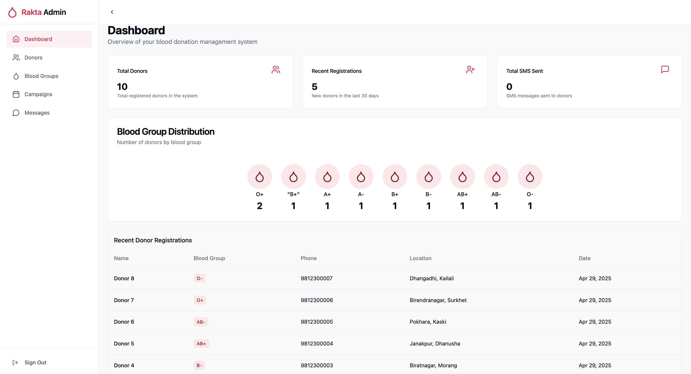
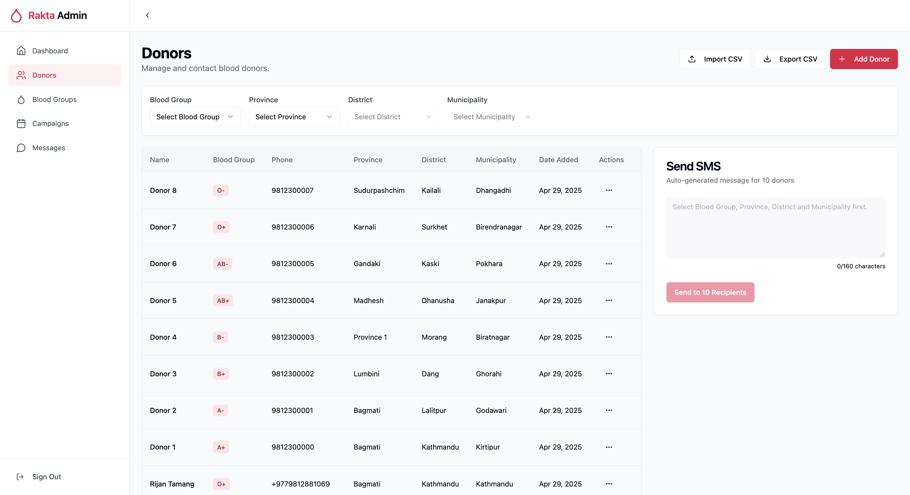
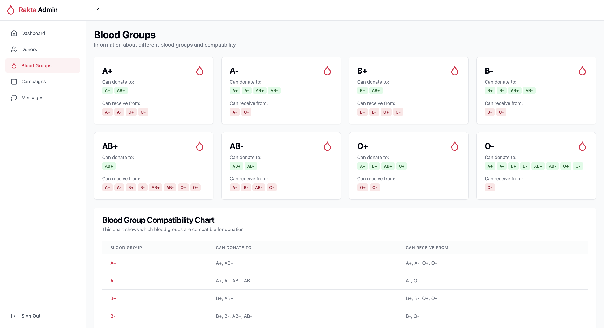

---

# 🩸 Rakta Blood Donation Admin Panel




---

<div align="center">
  <strong>Admin dashboard to manage blood donors, send urgent SMS alerts, and organize blood donation effectively.</strong>  
</div>

---

## 📸 Preview

|             Dashboard              |           Donor List           |           Eligible Donors            |
| :--------------------------------: | :----------------------------: | :----------------------------------: |
|  |  |  |

---

## ✨ Features

- 📋 **Manage Donors**: Add, edit, or remove donors.
- 🔎 **Filter Easily**: Search by blood group, province, district, and municipality.
- 📂 **CSV Upload**: Import donors in bulk via a CSV file.
- 💬 **SMS Alerts**: Message filtered donors via Sparrow SMS / Twilio.
- 📈 **Live Dashboard**: See donor counts, latest activity.
- 📱 **Fully Responsive**: Mobile and desktop friendly.

---

## 🛠️ Tech Stack

| Technology               | Purpose                       |
| ------------------------ | ----------------------------- |
| **Next.js**              | React framework for frontend  |
| **TailwindCSS**          | UI styling and responsiveness |
| **Supabase**             | Authentication and database   |
| **Twilio / Sparrow SMS** | SMS gateway integrations      |

---

## 🚀 Getting Started

### 1. Clone the Repository

```bash
git clone https://github.com/iamsulavgautam/rakta-admin-panel.git
cd rakta-admin-panel
```

### 2. Install Dependencies

```bash
npm install
# or
yarn install
```

### 3. Configure Environment Variables

Create a `.env.local` file:

```env
NEXT_PUBLIC_SUPABASE_URL=your_supabase_url
NEXT_PUBLIC_SUPABASE_ANON_KEY=your_supabase_anon_key

TWILIO_ACCOUNT_SID=your_twilio_account_sid
TWILIO_AUTH_TOKEN=your_twilio_auth_token
TWILIO_SERVICE_SID=your_twilio_service_sid

SPARROW_API_KEY=your_sparrow_api_key
```

### 4. Run Locally

```bash
npm run dev
# or
yarn dev
```

Visit `http://localhost:3000` to see the app in action 🚀

---

## 📜 CSV Upload Format

Ensure your CSV has the following headers:

```csv
name,blood_group,phone,province,district,municipality
```

Example:

```csv
Sulav Gautam,A+,9800000000,Province 5,Dang,Ghorahi
Anish Thapa,B-,9811111111,Province 3,Kathmandu,Kirtipur
```

✅ Correct formatting = Successful bulk import!

---

## 💬 SMS Functionality

- SMS sending requires selected filters (blood group, location).
- Messages are routed through Twilio or Sparrow based on setup.
- Instant communication with eligible donors 🚑

---

## 📈 Dashboard Overview

- View total donors
- Monitor latest added entries
- Quick action buttons for sending mass SMS

---

## 🧠 Future Enhancements (Planned)

- 🗓️ Add **last donated date** for donors
- 🚦 **Eligibility logic** (90-day donation gap enforcement)
- 📄 **SMS templates** for frequent use
- 🔒 **Admin roles** and **access levels**

---

## 🤝 Acknowledgements

- ❤️ **Supabase** — for simplifying backend work
- ❤️ **Twilio** and **Sparrow SMS** — for enabling SMS services
- ❤️ All **voluntary donors** — saving lives!

---

<div align="center">
  <strong>Made by Sulav Gautam</strong>
</div>

---
